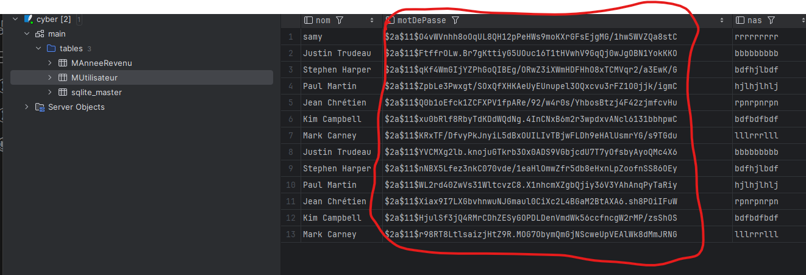
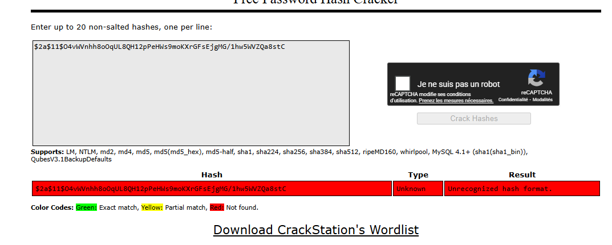
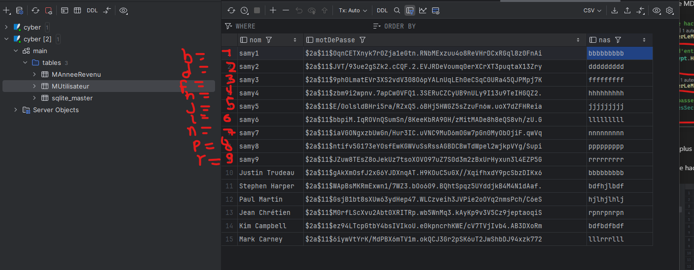
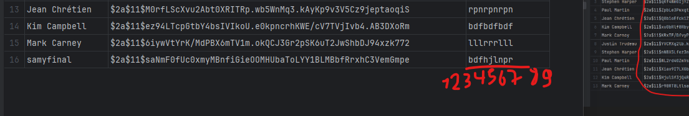
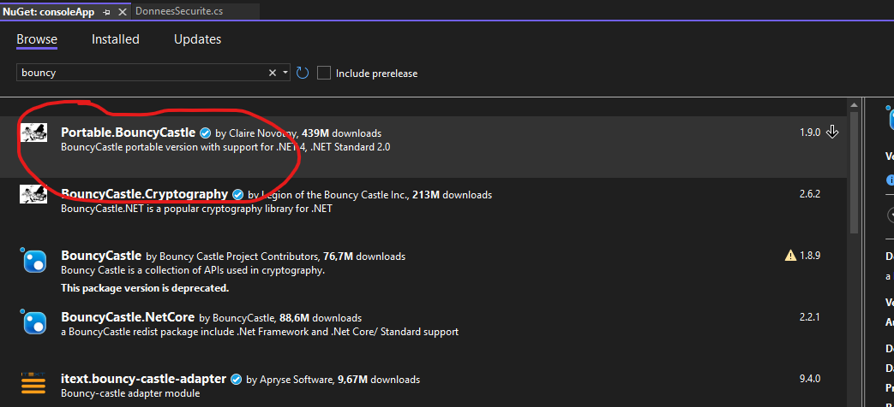
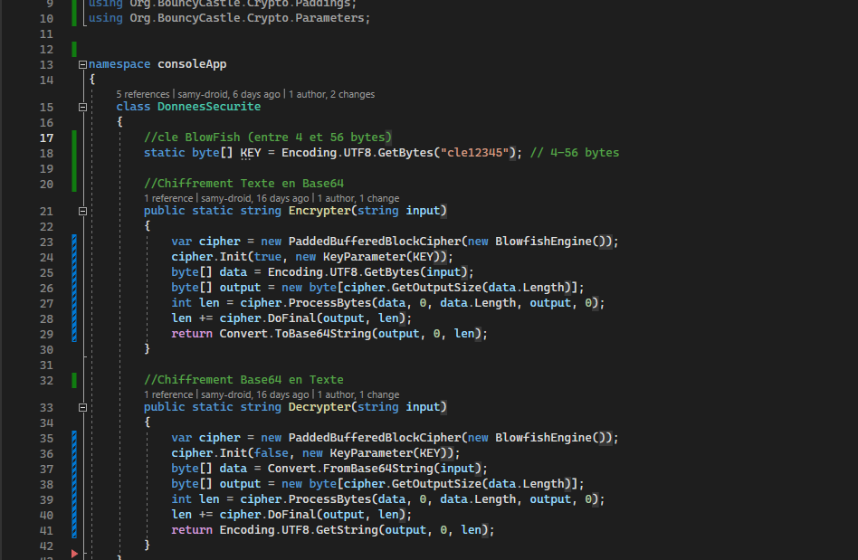
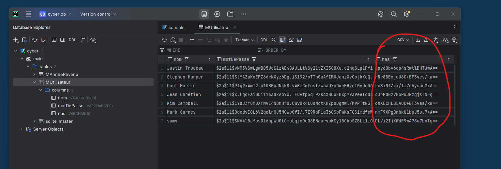

# Rapport TP3 de Cybersec NOM PRENOM

## Attaque 1: BD fuitée et mot de passe

1. Etape 1 
Trouver l'emplacement de la BD en utilisant System Informer

2. Etape 2 
Ouvrir la BD avec dataGrip afin de trouver les mot de passes hachées.

3. Trouver les mots de passes des premiers ministres avec crackStation ( sauf pour Stephen Harper et Paul Martin).

Justin trudeau : Passw0rd1!
Jean Chrétien : shawinigan
Kim Campbell : 	GirlPower
Mark carney : 	fortsmith

### Correctif implanté

Description du correctif.

Pour plus de sécurité on va modifier le code source de l'application
Pour ce faire on va changer le hachage md5  avec un hachage avec BCrypt qui va utiliser un sel unique et un hachage plus sécurisé.

1. Étape 1
Télécharger la librairie BCrypt :

2. Étape 2
Remplacer le hachage MD5 en BCrypt

Preuve que l'attaque ne fonctionne plus avec étapes + copie d'écran

1. On peut clairement voir que le hachage est dans un autre format plus difficile à cracker

2. Malgré que j'ai mis 1234 comme mot de passe crackstation n'arrive pas à le déchiffrer donc le correctif fonctionne parfaitement.

## Attaque 2: BD fuitée et encryption

1. Etape 1 
On a déjà accès à la base de données donc on va essayer de trouver la logique d'encryption en faisant des tests de NAS de 1 à 9.

Après ces tests on peut voir que :
1=b
2=d
3=f
4=h
5=j
6=l
7=n
8=p
9=r

2. Etape 2 
Juste pour tout confirmer j'ai créée un NAS : 123456789 et il m'a donné comme résultat : bdfhjlnpr comme prévu.

### Correctif implanté

Court descriptif du correctif 

1. On va utiliser un algo d'encryption classique pour les NAS, pour y arriver on va utiliser BlowFish
On commence avec l'installation du paquet Portable.BouncyCastle

2. On implante du code C# pour faire de la crypto symétrique et crypter les NAS avec BlowFish

Preuve que l'attaque ne fonctionne plus avec étapes + copie d'écran

3. Maintenant le format de cryptage des NAS a changé et on ne peut plus suivre une logique pour deviner la logique d'encryption.

## Attaque 3 Injection SQL

1. 
2. 
3. 

### Correctif implanté

Description du correctif.

Preuve que l'attaque ne fonctionne plus avec étapes + copie d'écran
