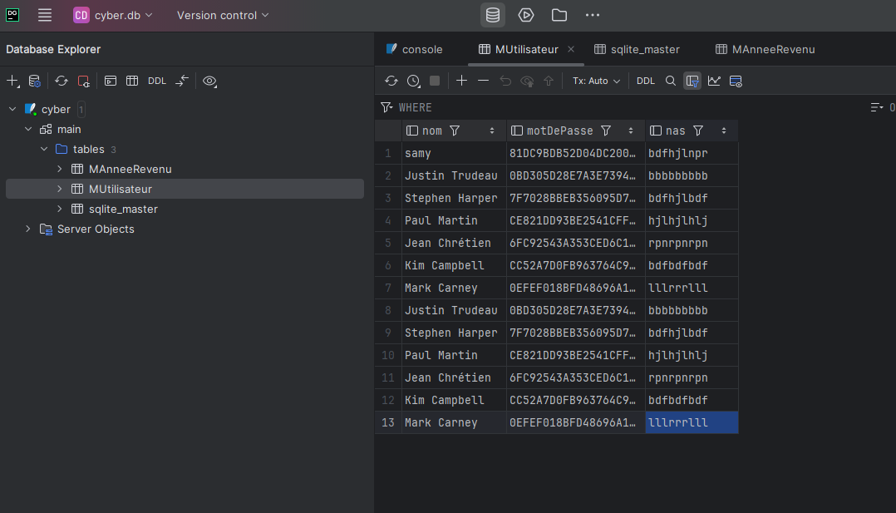
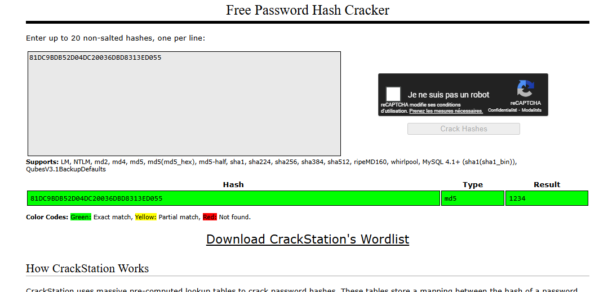
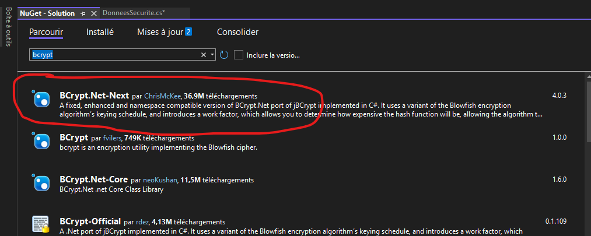
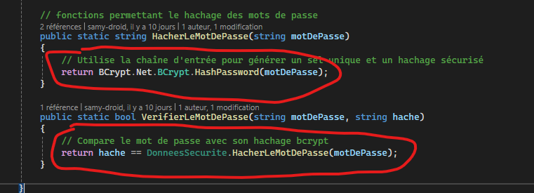

# Rapport TP3 de Cybersec NOM PRENOM

## Attaque 1: BD fuitée et mot de passe

1. Etape 1 
Trouver l'emplacement de la BD en utilisant System Informer

2. Etape 2 
Ouvrir la BD avec dataGrip afin de trouver les mot de passes hachées.

3. Trouver les mots de passes des premiers ministres avec crackStation ( sauf pour Stephen Harper et Paul Martin).

Justin trudeau : Passw0rd1!
Jean Chrétien : shawinigan
Kim Campbell : 	GirlPower
Mark carney : 	fortsmith

### Correctif implanté

Description du correctif.

Pour plus de sécurité on va modifier le code source de l'application
Pour ce faire on va changer le hachage md5  avec un hachage avec BCrypt qui va utiliser un sel unique et un hachage plus sécurisé.

1. Étape 1
Télécharger la librairie BCrypt :

2. Étape 2
Remplacer le hachage MD5 en BCrypt

Preuve que l'attaque ne fonctionne plus avec étapes + copie d'écran

## Attaque 2: BD fuitée et encryption

1. Etape 1 + copie d'écran
2. Etape 2 + copie d'écran
3. etc.

### Correctif implanté

Court descriptif du correctif et lien vers le(s) commit(s).

Preuve que l'attaque ne fonctionne plus avec étapes + copie d'écran

## Attaque 3 Injection SQL

1. Etape 1 + copie d'écran
2. Etape 2 + copie d'écran
3. etc.

### Correctif implanté

Description du correctif.

Preuve que l'attaque ne fonctionne plus avec étapes + copie d'écran
